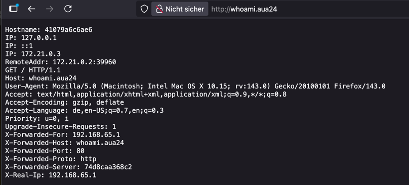

# Local traefik setup


## Table of Contents

1. [What is traefik](#what-is-traefik)
2. [Benefits](#benefits)
3. [Known Issues](#known-issues---with-solutions-)
4. [Requirements](#requirements)
    1. [Docker](#docker)
    2. [dnsmasq](#dnsmasq)
    3. [resolver](#resolver)
    4. [Traefik](#traefik)
5. [Useful cli commands](#useful-cli-commands)
    1. [Show traefik logs](#show-traefik-logs)
    2. [Show dnsmasq logs](#show-dnsmasq-logs)
    3. [Restart Traefik](#restart-traefik)
    4. [Restart dnsmasq](#restart--stop-dnsmasq)
    5. [Test if dnsmasq is running](#test-if-dnsmasq-is-running)
6. [Small test project](#small-test-project)

## What is traefik

[Traefik](https://traefik.io/) is a modern HTTP reverse proxy and ingress controller that makes deploying microservices
easy. It can also be used to improve local web development with multiple services.

[traefik repository on github](https://github.com/traefik/traefik-library-image)

## Benefits

1. There are no more port collisions, no matter how many projects are running locally in parallel.
2. This setup also allows real domains to be used locally, which makes it possible, for example, to run Smart Lens
   locally against web services prepared with Docker like a TYPO3 or Magento Webshop.
3. All developers within the projects always use the same versions of dependencies, such as Node.
4. Easy https implementation for local development or test cases.

## Known issues - with solutions 😎

1. The challenge is that a TLD is being used that does not officially exist and is not in danger of being used as an
   official TLD at some point in the future. Suggestion: `aua24` -> http://example-project.aua24
2. When all necessary dependencies are running in Docker containers, it is no longer as easy to execute something like
   `npm run format` in the CLI. This must always be executed in the according Docker container
   (`docker compose exec <container-name> npm run format`), which complicates the execution. A
   small, self-developed task runner could remedy this situation, enabling commands such as `smart npm run format`.
   Another idea would be to simply use makefiles.
3. [Docker Hub rate limit](https://docs.docker.com/docker-hub/usage/) can be a huge problem if everyone is an
   unauthenticated Docker user in the same network. There are two solutions for this problem: We just pay for it, or we
   mirror all needed images in our Gitlab and build them there just one time per day.
4. Mixed development setup, such as Arinna and Support Ops. It is still possible, but instead of using
   `http://localhost` as the domain, the consuming app must use `http://host.docker.internal`.

## Requirements

### Docker

#### MacOS

It is assumed that homebrew is already installed.

```shell
brew install --cask docker
```

#### Linux (Ubuntu)

See other distributions in the [docs of Docker](https://docs.docker.com/engine/install/)

```shell
sudo apt-get install docker-ce docker-ce-cli containerd.io docker-buildx-plugin docker-compose-plugin
```

#### Windows

See installation instruction in the [Docker docs](https://docs.docker.com/desktop/setup/install/windows-install/)

### dnsmasq

If dnsmasq is running on MacOS or Linux (Ubuntu), sudo can be used to restart it at system startup. Without superuser
privileges, dnsmasq must be started manually at each system startup.

#### MacOS

```shell
brew install dnsmasq
mkdir -pv $(brew --prefix)/etc/
echo 'address=/.aua24/127.0.0.1' > $(brew --prefix)/etc/dnsmasq.conf
sudo brew services start dnsmasq
```

#### Linux (ubuntu)

```shell
sudo apt-get install dnsmasq 
echo 'address=/.aua24/127.0.0.1' > /etc/dnsmasq.conf
sudo systemctl start dnsmasq 
```

#### Windows (not tested)

No need to install something like dnsmasq on Windows.

### resolver

#### MacOS and Linux

```shell
sudo mkdir -p /etc/resolver
echo 'nameserver 127.0.0.1' > /etc/resolver/aua24
```

#### Windows (not tested)

1. Open Windows Network Settings -> Adapter Properties -> IPv4 Settings
2. Set DNS server `127.0.0.1`
3. Add normal DNS as fallback (e.g. `1.1.1.1` or `8.8.8.8`)

### traefik

Traefik should run in its own Docker container and not be repeatedly restarted within the projects.
Therefore, Traefik is made available somewhere with a Docker Compose file, in this example under `~/work/traefik/`.

```yaml
services:
  traefik:
    image: traefik:v3.5
    container_name: traefik
    restart: always
    command:
      - "--api.insecure=true"
      - "--providers.docker=true"
      - "--providers.docker.exposedbydefault=false"
      - "--entrypoints.web.address=:80"
    ports:
      - "80:80"
      - "8080:8080" # Dashboard
    volumes:
      - "/var/run/docker.sock:/var/run/docker.sock:ro"
    networks:
      - traefik

networks:
  traefik:
    name: traefik
```

#### MacOS and Linux

```shell
mkdir -p ~/work/traefik

cat <<'EOF' > ~/work/traefik/compose.yaml
services:
  traefik:
    image: traefik:v3.5
    container_name: traefik
    restart: always
    command:
      - "--api.insecure=true"
      - "--providers.docker=true"
      - "--providers.docker.exposedbydefault=false"
      - "--entrypoints.web.address=:80"
    ports:
      - "80:80"
      - "8080:8080" # Dashboard
    volumes:
      - "/var/run/docker.sock:/var/run/docker.sock:ro"
    networks:
      - traefik

networks:
  traefik:
    name: traefik
EOF

cd ~/work/traefik && docker compose up -d
```

#### Windows

Unfortunately, I don't have a ready-made script for quick deployment here. Create a `compose.yaml` with the above
content and start it in the background.

## Useful cli commands

### Show traefik logs

#### MacOS and Linux (ubuntu)

```shell
docker logs -f traefik
```

### Show dnsmasq logs

```shell
log show --predicate 'process == "dnsmasq"' --last 1m
```

### Restart traefik

```shell
docker compose restart traefik
```

### Restart / stop dnsmasq

#### MacOS

```shell
sudo brew services restart dnsmasq
```

```shell
sudo brew services stop dnsmasq
```

#### Linux (ubuntu)

```shell
sudo systemctl restart dnsmasq 
```

```shell
sudo systemctl stop dnsmasq 
```

### Test if dnsmasq is running

```shell
ps aux | grep dnsmasq
```

## Small test project

```shell
mkdir -p ~/work/testapp
```

```yaml
services:
  whoami:
    image: traefik/whoami
    container_name: whoami
    labels:
      - "traefik.enable=true"
      - "traefik.http.routers.whoami.rule=Host(`whoami.aua24`)"
      - "traefik.http.routers.whoami.entrypoints=web"
    networks:
      - traefik

networks:
  traefik:
    external: true
```

```shell
docker compose up
```

