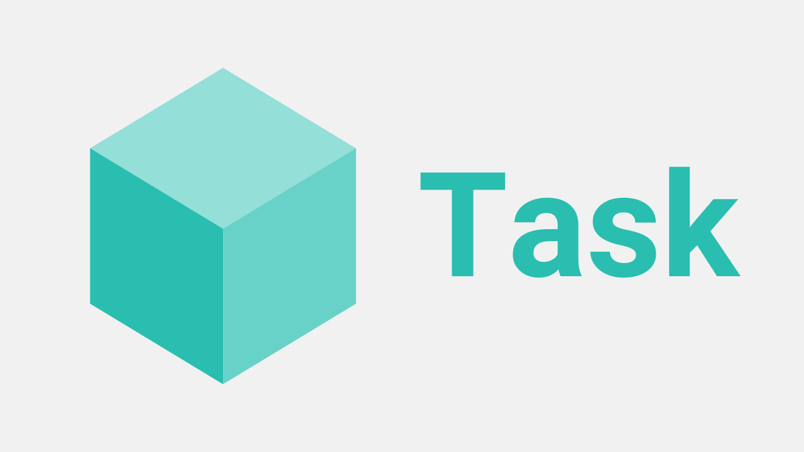

# Taskfile - The Universal Command Center



[Taskfile.dev](https://taskfile.dev/) aims to give us this by allowing us to use the same commands for EVERY project.

All projects amongst our companies can now use the same set of commands to run, build, install, etc. For example, `task install`

We have `npm` for commands, but some projects may uses `pnpm` and others `deno`. On top of that, docker will have to be run. 
Unify all of this in one command, that is the same across all projects in our companies.

### Quick Setup for Taskfile in your Project

1. Assuming you have `brew` installed,
```bash
brew install go-task
```
2. If you dont yet have a Taskfile and want to generate one,
   go into your root directory for your repo and
```bash
task --init
```
You're ready!

Alternatively, you can use the Taskfile in this project as a template for your project.

If that all fails, there are detailed and/or alternative ways to install Taskfile can be found 
[here](https://taskfile.dev/docs/installation) which do not involve `brew`. 

### Easy Taskfile use example

Below is an example of a Taskfile with explanations.
You are also welcome to view an example Taskfile at `Taskfile.example.yml`
The `Taskfile.yml`, on the otherhand, is a template for you to use in your project.

```yml
version: '3'

vars:
  INSTALL: Installs all dependencies needed for your project to run

tasks:
  install: # name of the task
    desc: {{.INSTALL}}
    cmds:
      # For every new command after '-', we start back at the root directory.
      #   To continue using the same path, please chain commands together with &&, 
      #   otherwise you will need to rewrite the path in the new '-'
      - cd frontend && npm install
      - cd backend && {install command}
  run:
    desc: 'Runs the project'
    cmds:
       - docker compose up --force-recreate --build --remove-orphans -d
       - cd frontend && npm run dev
```
To call any of these tasks, you go to the location of Taskfile and write `task {{command-name}}`.
In our example, this can be either `task install` or `task run`.

If you would like to see all tasks write `task --list`.

## Universal Taskfile commands that everyone needs

### Mandatory Tasks
The following tasks must be available in **every** project:

* install
* update
* run
* stop

If no installation is necessary the tasks should simply do nothing, but still will be available.

#### install

The install task will setup the project for you. It will install dependencies (npm, virtualenv, …), and
make sure an initial config exists.

#### update

When working on a project you may at some time introduce changes that might break the installation
of the project for your colleges. This might include changing the database schema, add additional
configuration options,

`task update` will use the necessary tools to make sure the project is up to date. This means for
example running database migrations.

#### run

Starts the local development server, most of the time we will use something like http://localhost:8000/ for
this. The development server may be started inside a docker container using docker-compose.

#### stop

Stops the development server.

### Other Core Tasks

Should mostly be in all Taskfiles

#### clean

The clean task will remove any files installed by b5. This includes for example the node_modules-directory
introduced by `npm install`.

#### deploy

Takes at least one parameter: Server to deploy to (example: `task deploy staging`)

Will deploy all the changes from the local repository to the server.

#### deploy:install

Like `deploy` but will only setup the project on the server. It will not try to run tasks for
updating the project as these will fail (example: running database migrations without having configured
the database connection is a bad idea).

### Optional Tasks

The following tasks may exist, but are not as standardised as the tasks above:

#### test

Will exeecute the test suite.

#### lint

Will execute the linter and give you details if anything does not follow the coding guidelines.

#### css

This task will build the CSS files necessary for your project. It will build these files once and then
exit. May use Sass or less for doing so.

#### js

The js task will build any Javascript files inside your project. This may use Typescript or just webpack to
combine multiple files. It will exit after doing so.

#### watch

The watch task will build CSS and Javascript files on every change. It will stay alive until canceled
using Ctrl+C. No other jobs are started, so for example no browsersync will be launched.


